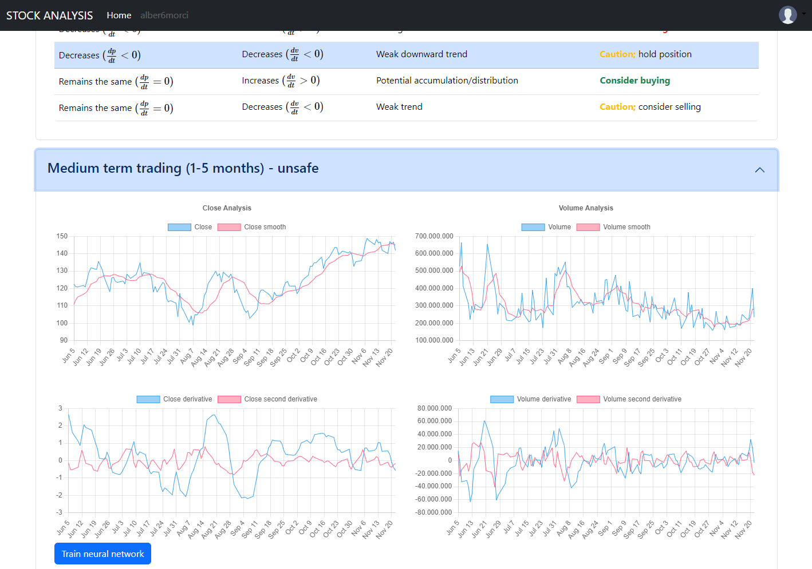

# stock-analysis

A personal portfolio for stock trading that utilizes various mathematical models to conduct market analysis, enabling the determination of optimal buy and sell opportunities for stocks.

> [!IMPORTANT] 
I am not responsible for any use that may be made of this software.

*This project is still under development.*

## Features
* Short term trading: decision tree.
* Medium term trading: deep learning approach (RNN).
* Long term trading: linear regression.


## Backend depencencies
```
flask
flask-cors
```

If you have Anaconda installed:

```
conda env create -f environment.yml
```

## Frontend dependencies
```
Bootstrap
Chart.js
MathJax
TensorFlow.js
```

## Screenshots




