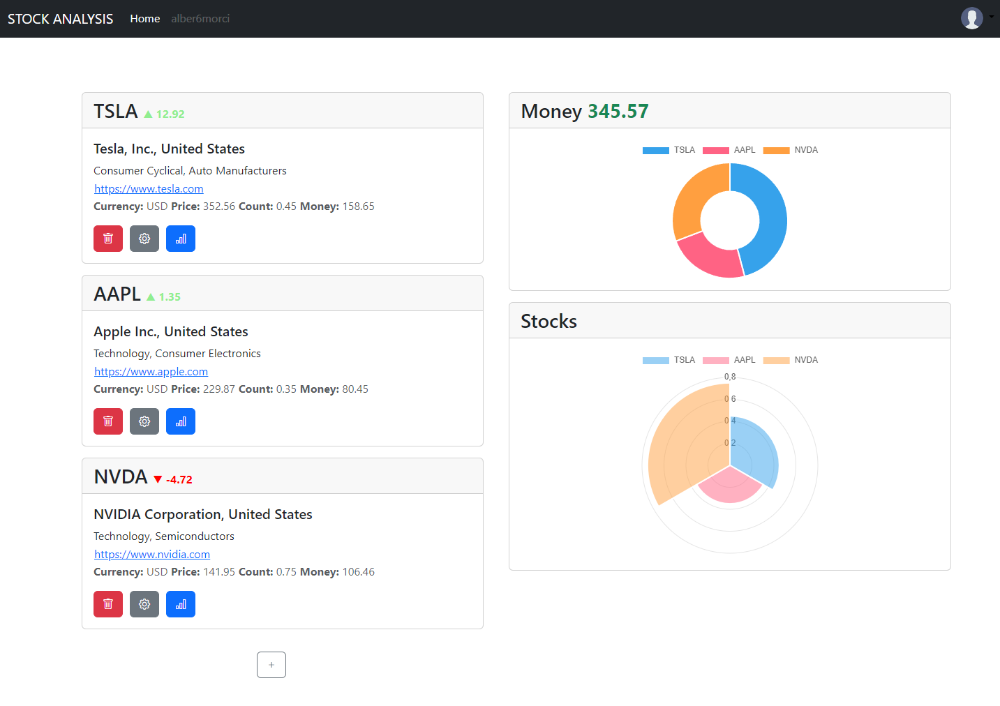
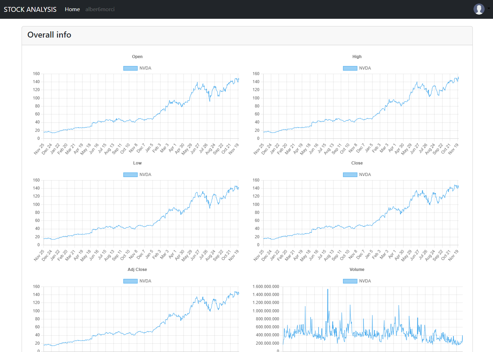
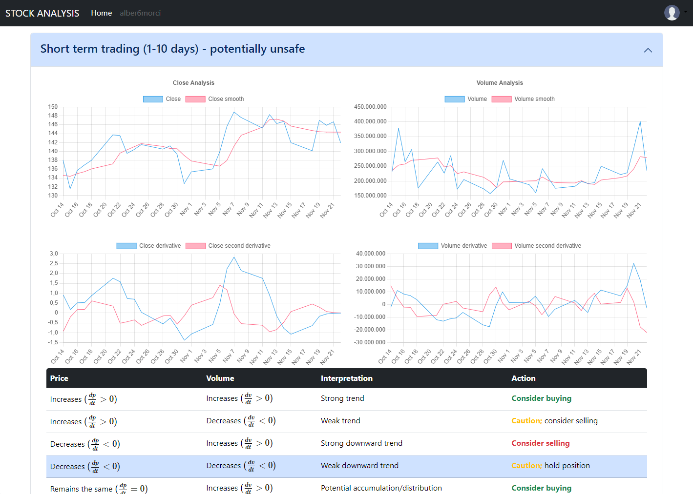
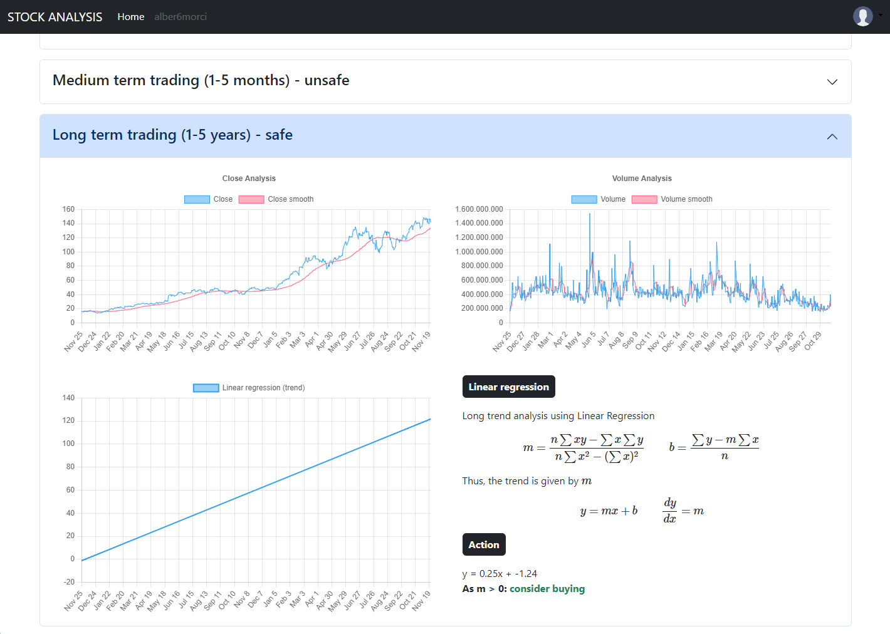

# stock-analysis

This project is a `personal portfolio for stock trading` that leverages various `mathematical models` to perform `market analysis`. It aims to identify optimal buy and sell opportunities, helping traders make informed decisions in the stock market.

> [!IMPORTANT] 
I am not responsible for any use that may be made of this software. It is only made for educational purposes.

> [!NOTE]
*This project is still under development.*

## Features
* **Short-term trading:** Predict optimal buy and sell points using a `decision tree model`.
* **Medium-term trading:** Predict optimal buy and sell points using a `Deep Learning approach (RNN)`.
* **Long-term trading:** Predict optimal buy and sell points using `linear regression`.



### Backend depencencies
```
flask
flask-cors
```

If you have Anaconda installed:

```
conda env create -f environment.yml
```

### Frontend dependencies
```
Bootstrap
Chart.js
MathJax
TensorFlow.js
```

### Screenshots

**Overall info:**



**Market analysis:**



